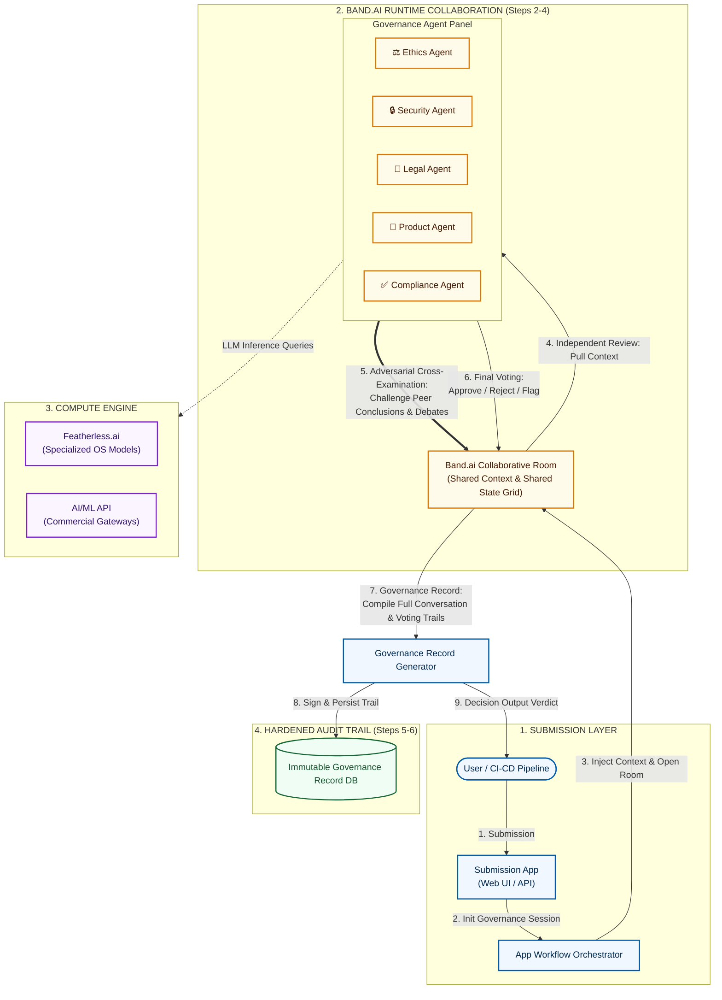

# The AI Charter

> **A multi-agent governance system for responsible AI deployment.**

Before an AI feature ships, five specialized agents — each representing a distinct governance perspective — review the proposal, cast a vote, and produce a defensible audit trail. No ad-hoc sign-offs. No opaque decisions. Just a structured, repeatable process your team can stand behind.

  

---

## The Problem

Organizations shipping AI products face pressure from regulators, customers, and internal stakeholders to prove that releases are ethical, secure, legally compliant, and well-governed. In practice, the review process is almost always:

- **Inconsistent** — dependent on whoever happens to be in the room
- **Opaque** — decisions aren't documented or explainable after the fact
- **Slow** — manual review creates bottlenecks for fast-moving teams
- **Fragmented** — ethics, security, legal, and compliance concerns are reviewed in silos, if at all

The AI Charter replaces this with a repeatable, multi-perspective, automated workflow — producing both a decision and a defensible record of _why_ that decision was made.

---

## How It Works

A team submits a proposed AI feature or model change. A panel of specialized agents independently reviews the submission, casts a vote, and returns its reasoning. The system compiles everything into a permanent governance record.

### The Agent Panel

| Agent                   | Focus Area                                                                  |
| ----------------------- | --------------------------------------------------------------------------- |
| ⚖️ **Ethics Agent**     | Fairness, bias, potential for harm, and alignment with stated values        |
| 🔒 **Security Agent**   | Attack surface, data handling, and abuse/misuse risks                       |
| 📜 **Legal Agent**      | Regulatory exposure, IP concerns, and jurisdictional requirements           |
| 🚀 **Product Agent**    | User impact, UX implications, and business rationale                        |
| ✅ **Compliance Agent** | Alignment with internal policies and external standards (GDPR, SOC 2, etc.) |

### The Workflow

```
Submit → Independent Review → Vote → (Optional) Cross-Examination → Governance Record → Decision
```

1. **Submission** — A team submits a feature or model change with relevant context: description, intended use, data sources, and a risk assessment.
2. **Independent Review** — Each agent analyzes the submission from its domain perspective, drawing on its own evaluation criteria.
3. **Voting** — Agents cast a vote: **Approve**, **Reject**, or **Flag for Human Review**.
4. **Adversarial Cross-Examination** _(optional)_ — Agents challenge each other's conclusions, surfacing disagreements before a final decision is locked.
5. **Governance Record** — All votes, reasoning, and cross-examination output are compiled into a permanent, timestamped record.
6. **Decision Output** — A final recommendation is produced: unanimous approval, conditional approval with required mitigations, or rejection — each backed by a full audit trail.

### Architecture



---

## Governance Records & Reasoning Trails

Every review produces a structured, timestamped record containing:

- The original submission and all supporting context
- Each agent's vote and the full reasoning behind it
- Points of disagreement between agents and how they were resolved
- The final decision and any conditions attached to approval
- A unique reference ID for audit and retrieval purposes

These records create **institutional memory** for AI governance — actionable during regulatory inquiries, internal retrospectives, and stakeholder due diligence, not just at the moment of release.

---

## Who This Is For

- **AI product teams** that want a structured pre-release review that goes beyond a single reviewer's gut check
- **Compliance and risk teams** that need documented evidence of governance processes
- **Startups** that want to demonstrate responsible AI practices to investors, partners, or regulators without standing up a full governance department
- **Enterprises** standardizing AI review across multiple teams and products

---

## Project Status

🚧 _Early development._ Core agent definitions, voting logic, and the governance record schema are actively being designed as part of the [Band of Agents Hackathon](https://bandofagents.dev) — Regulated Workflows track (June 12–19, 2026).

---

## Roadmap

**Near-term**

- [ ] Define agent evaluation criteria and prompt frameworks for each governance role
- [ ] Build voting and consensus / disagreement resolution logic
- [ ] Design governance record schema (storage format, retention policy)
- [ ] Implement adversarial cross-examination workflow

**Later**

- [ ] Build submission interface (CLI / web / API)
- [ ] Add configurable governance policies per organization
- [ ] Export and reporting tools for audits and compliance reviews

---

## Contributing

Contributions, ideas, and feedback are welcome. Please open an issue to discuss proposed changes before submitting a pull request.

---

## License

To be determined.

---

> **Disclaimer:** The AI Charter is a decision-support and documentation tool. It does not replace human judgment, legal counsel, or formal compliance certification. Organizations remain responsible for their own AI governance and regulatory obligations.
