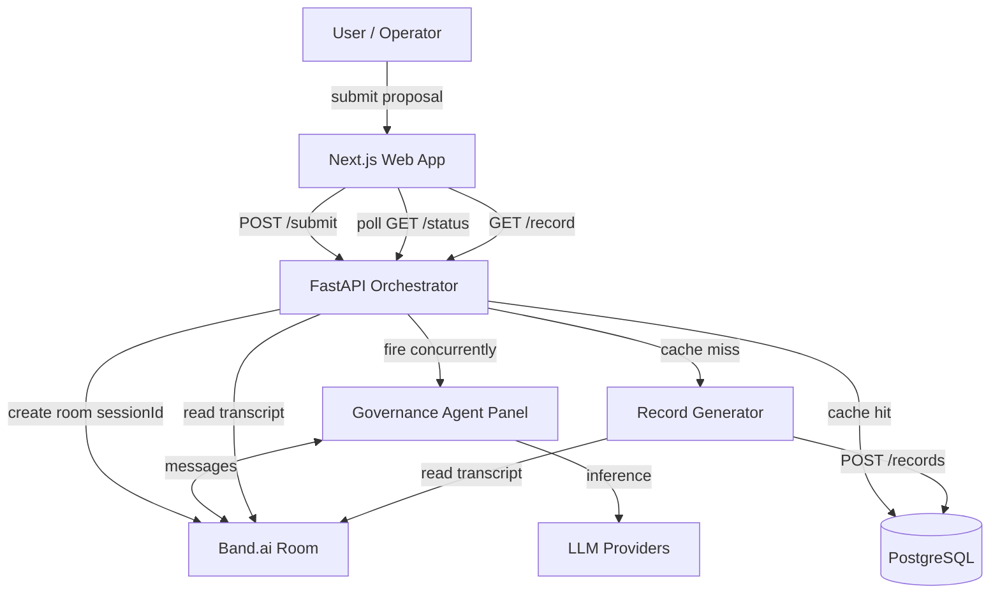

# Architecture Overview

The AI Charter is a monorepo with three runtime services: a **Next.js frontend**, a **FastAPI backend**, and **PostgreSQL**. External services include **Band.ai** (agent collaboration rooms) and **LLM providers** (OpenRouter, Featherless, or AI/ML API).

---

## System flow



---

## Core workflow

```
Submit → Band Room Created → Independent Review → Cross-Examination → Voting → Governance Record
```

1. **Submit** — Operator submits a feature proposal via the web form (`POST /submit`).
2. **Band Room** — Orchestrator creates a Band.ai room. `room_id` = `sessionId` throughout the system.
3. **Independent Review** — Five agents run concurrently. Each joins the room, evaluates via LLM, posts findings.
4. **Cross-Examination** — Agents read peer findings and may post `challenge` messages.
5. **Voting** — Each agent casts `approve` / `reject` / `flag` via deterministic Python logic.
6. **Governance Record** — Record generator compiles the Band transcript into a structured audit document.

---

## Repository layout

```
The-AI-Charter/
├── backend/           # Python FastAPI application
│   ├── orchestrator/  # API endpoints, agent orchestration
│   ├── agents/        # Five governance agents + base class
│   ├── shared/        # Schemas, LLM client, DB models
│   ├── record/        # Transcript → GovernanceRecord compiler
│   ├── band.py        # Band.ai SDK wrapper
│   └── tests/         # pytest suite
├── web/               # Next.js 16 frontend
│   └── src/
│       ├── app/       # App Router pages
│       ├── components/# UI components by domain
│       ├── lib/       # API client, polling, utils
│       └── types/     # Shared TypeScript types
├── docker/            # Docker Compose + Dockerfiles
├── docs/              # Documentation (this suite)
└── .env               # Runtime configuration (not committed)
```

---

## Service boundaries

| Layer | Technology | Responsibility |
|-------|------------|----------------|
| Presentation | Next.js 16, React 19, Tailwind 4 | Forms, live review, record viewer, auth UI |
| API | FastAPI | Submission, status, records, auth |
| Collaboration | Band.ai (Thenvoi SDK) | Shared room, message transcript, agent invites |
| Inference | OpenRouter / Featherless / AI/ML API | LLM calls for agent evaluations |
| Persistence | PostgreSQL + SQLModel | Users, cached governance records |

---

## Key design principles

| Principle | ADR |
|-----------|-----|
| Band room is the collaboration surface and audit source | [0001](../adr/0001-band-as-collaboration-surface.md) |
| Votes and verdicts are deterministic Python, not LLM | [0002](../adr/0002-deterministic-voting-and-verdicts.md) |
| `sessionId` === Band `room_id` | [0003](../adr/0003-session-id-equals-band-room-id.md) |
| snake_case backend, camelCase frontend | [0004](../adr/0004-snake-case-backend-camelcase-frontend.md) |

---

## Agent panel

| Agent | ID | Focus | Status |
|-------|-----|-------|--------|
| Security | `security` | Attack surface, data handling, abuse risks | Implemented |
| Ethics | `ethics` | Fairness, bias, harm potential | Implemented |
| Legal | `legal` | Regulatory exposure, IP, jurisdiction | Implemented |
| Product | `product` | User impact, UX, business rationale | Implemented |
| Compliance | `compliance` | Policy checklists, standards, audit evidence | Implemented |

See [Agents](AGENTS.md) for implementation details.

---

## Related

- [Backend](BACKEND.md)
- [Frontend](FRONTEND.md)
- [API Contracts](../design/API_CONTRACTS.md)
- [Product Guide](../PRODUCT-GUIDE.md)
